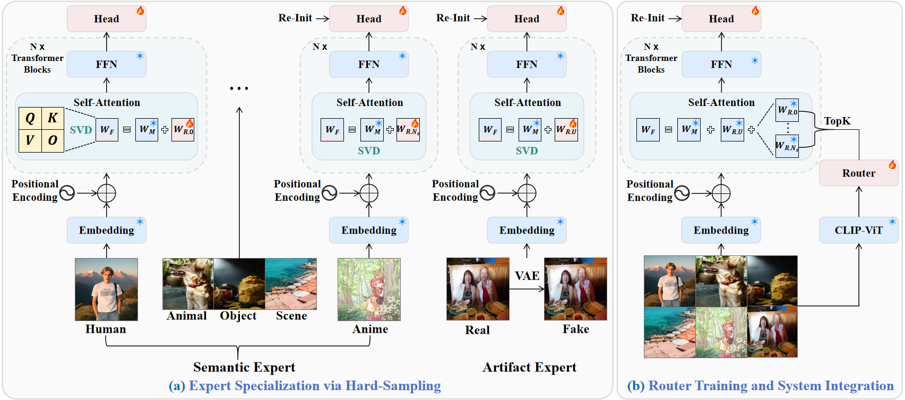

# OmniAID: Decoupling Semantics and Artifacts for Universal AI-Generated Image Detection in the Wild

<div align="center">

[](https://yunncheng.github.io/OmniAID/)
[](https://huggingface.co/spaces/Yunncheng/OmniAID-Demo)
[](https://huggingface.co/Yunncheng/OmniAID/tree/main)
[](https://huggingface.co/datasets/Yunncheng/Mirage-Test)
[](https://arxiv.org/abs/2511.08423)
[](https://opensource.org/licenses/MIT)

</div>


## 📖 Introduction

**OmniAID** is a universal AI-generated image detector designed for real-world, in-the-wild scenarios. 

Most existing detectors collapse under distribution shift because they entangle high-level semantic flaws (e.g., distorted humans, inconsistent object logic) and low-level generator artifacts (e.g., diffusion-specific fingerprints), learning a single fused representation that generalizes poorly. 

To address these fundamental limitations, OmniAID explicitly decouples semantic and artifact cues through a **hybrid Mixture-of-Experts (MoE)** architecture—paired with a new modern dataset, Mirage, which reflects contemporary generative models and realistic threats.





## 🌟 Key Features

### 🧠 Hybrid MoE Architecture
- **Routable Semantic Experts**  
  Specialized experts dedicated to specific semantic domains (Human, Animal, Object, Scene, Anime).

- **Fixed Universal Artifact Expert**  
  Always active, focusing solely on content-agnostic generative artifacts.


### ⚙️ Two-Stage Training Strategy

1. **Expert Specialization**  
   Each semantic expert is trained independently with domain-specific hard sampling.

2. **Router Training**  
   A lightweight router learns to dispatch inputs to the most relevant semantic experts, while the artifact expert is always included.


## 📢 News

- 🎉 **2026/05/01**: OmniAID has been accepted by **ICML 2026**!
- 🗓️ **2026/02/03**: OmniAID now supports **LoRA-style fine-tuning** and **DINOv3** backbone. (Please ensure to update your environment according to [`requirements.txt`](./requirements.txt) for the latest features.)
- 🗓️ **2025/12/10**: We have released a clean inference script for deploying OmniAID as a reward model.
- 🗓️ **2025/11/30**: We have released training and testing code, along with model weights.  
- 🗓️ **2025/11/11**: OmniAID paper is now available on [arXiv](https://arxiv.org/abs/2511.08423).


## 🚀 Online Demo

Experience OmniAID instantly in your browser.
This demo is powered by the OmniAID checkpoint trained on Mirage-Train.

> **[Try OmniAID on Hugging Face Spaces](https://huggingface.co/spaces/Yunncheng/OmniAID-Demo)**

**Supported Modes:**
* **🤖 Auto (Router) Mode** (Default)
    The lightweight router dynamically analyzes the input image and assigns optimal weights to specific semantic experts.
* **🎛️ Manual Mode** (Analysis)
    Allows you to manually adjust expert weights to interpret how different semantic domains or the universal artifact expert contribute to the final detection score.


## 🦾 Act as a Reward Model

OmniAID has been successfully integrated as a reward model to guide the image generator [RealGen](https://github.com/yejy53/RealGen/tree/main). By providing fine-grained feedback on both semantic plausibility and low-level generative artifacts, OmniAID enables RealGen to produce images with significantly enhanced realism and fewer detectable AI fingerprints.


To facilitate its use in other generation pipelines, we provide a clean and self-contained test script for deploying OmniAID as a reward model. You can find the reference implementation in `reward/clean_test.py`. This script demonstrates how to load the pre-trained checkpoint and compute a detection score for a list of input images, which can be directly used as a reward signal for reinforcement learning-based generation.


## 📚 Dataset Download


### 🔸 GenImage-SD v1.4 (Classified)
A reorganized subset of GenImage-SD v1.4, classified into semantic categories (Human_Animal, Object_Scene) to train the Semantic Experts.

[Download via Google Drive](https://drive.google.com/drive/folders/1Y5Fbf2Dm-trRxmmyXlcPgjYY9h_7BOUz?usp=sharing)

### 🔸 GenImage-SD v1.4 Reconstruction
The real images from the GenImage-SD v1.4 subset, reconstructed using the SD1.4 VAE.
We apply the reconstruction methodology from [AlignedForensics](https://github.com/AniSundar18/AlignedForensics/tree/master) to this specific dataset to serve as "purified" reference data for artifact learning.

[Download via Google Drive](https://drive.google.com/drive/folders/1c3Ybk4NEfAXDs4VyxRoT_MjHVz3nErrF?usp=sharing)

### 🔸 Mirage-Test
A challenging evaluation set containing images from held-out modern generators, optimized for high realism to rigorously test model generalization.

[Download via Hugging Face](https://huggingface.co/datasets/Yunncheng/Mirage-Test)  
[Download via Google Drive](https://drive.google.com/file/d/1-iGPbOkzGK-91LDyqeFSQefFPmZ41E2_/view?usp=sharing)


## 📦 Model Zoo

We provide checkpoints trained on different datasets and different backbones. All models are hosted on Hugging Face.

| Model Variant | Training Data | Backbone | Filename | Paired config | Download |
| :--- | :--- | :--- | :--- | :--- | :--- |
| **OmniAID-DINO v2 (Recommended)** | **Mirage-Train** (Ours)| DINOv3 ViT-L/16 | `ckpt/checkpoint_omniaid_dino_v2.pth` | `config/config_omniaid_dino_v2.json` | [Link](https://huggingface.co/Yunncheng/OmniAID/blob/main/ckpt/checkpoint_omniaid_dino_v2.pth) |
| **OmniAID v2 (Recommended)** | **Mirage-Train** (Ours)| CLIP-ViT-L/14@336px | `ckpt/checkpoint_omniaid_v2.pth` | `config/config_omniaid_v2.json` | [Link](https://huggingface.co/Yunncheng/OmniAID/blob/main/ckpt/checkpoint_omniaid_v2.pth) |
| OmniAID-DINO v1 | **Mirage-Train** (Ours)| DINOv3 ViT-L/16 | `ckpt/checkpoint_omniaid_dino_v1.pth` | `config/config_omniaid_dino_v1.json` | [Link](https://huggingface.co/Yunncheng/OmniAID/blob/main/ckpt/checkpoint_omniaid_dino_v1.pth) |
| OmniAID v1 | **Mirage-Train** (Ours)| CLIP-ViT-L/14@336px | `ckpt/checkpoint_omniaid_v1.pth` | `config/config_omniaid_v1.json` | [Link](https://huggingface.co/Yunncheng/OmniAID/blob/main/ckpt/checkpoint_omniaid_v1.pth) |
| **OmniAID-GenImage** | GenImage-SD v1.4 | CLIP-ViT-L/14@336px | `ckpt/checkpoint_omniaid_genimage_sd14.pth` | `config/config_omniaid_genimage_paper.json` | [Link](https://huggingface.co/Yunncheng/OmniAID/blob/main/ckpt/checkpoint_omniaid_genimage_sd14.pth) |

> **Note:**
> * **OmniAID-DINO v2 (Recommended)** leverages the DINOv3 ViT-L/16 backbone. It delivers the strongest in-the-wild generalization in our tests, at the cost of **~1.5× slower inference** than the CLIP variant (with a similar slowdown in training).
> * **OmniAID v2 (Recommended)** uses the CLIP-ViT-L/14@336px backbone. It offers excellent in-the-wild generalization at faster inference, making it the preferred choice for throughput-sensitive deployments.
> * **OmniAID-GenImage** is trained on the standard academic GenImage-SD v1.4 benchmark. Use it to reproduce the paper's reported numbers and for fair comparison with prior baselines.
> * v2 is the current recommended release. Compared to v1, v2 uses more robust data augmentation and updated training data, yielding better in-the-wild generalization. v1 weights remain hosted for backwards compatibility and paper-number reproduction.


## 🛠️ Installation

```bash
git clone https://github.com/yunncheng/OmniAID.git
cd OmniAID
conda create -n omniaid python=3.10
conda activate omniaid
pip install -r requirements.txt
```

## ⚡ Quick Start

To reproduce our results or train on your own data, please follow the steps below.

### 1. Configuration
Modify the configuration file matching the backbone / dataset you want to use (see the **Paired config** column in the Model Zoo above). Each JSON specifies model hyperparameters (e.g., number of experts, rank, hidden dimensions) and other global settings. By default, the parameter `stage1_base_dir` should simply be set to the same path as `OUTPUT_DIR` in both the `scripts/train.sh` and `scripts/eval.sh` scripts.

```jsonc
{
    "CLIP_path": "openai/clip-vit-large-patch14-336",
    "DINOV3_path": "facebook/dinov3-vitl16-pretrain-lvd1689m",
    "num_experts": 3,
    "rank_per_expert": 4,
    // ...
}
```


### 2. Training
We provide a shell script for training. Before running, please open `scripts/train.sh` and configure the necessary paths:
* `DATA_PATH`: Path to your training dataset.
* `OUTPUT_DIR`: Directory where checkpoints will be saved.
* `LOG_DIR`: Directory where logs will be saved.
* `MOE_CONFIG_PATH`: Path to your configuration JSON (see the **Model Zoo** above).

Once configured, start training:

```bash
bash scripts/train.sh
```

### 3. Evaluation
To evaluate the model on test sets, open `scripts/eval.sh` and set the following:
* `EVAL_DATA_PATH`: Path to the validation/test dataset.
* `OUTPUT_DIR`: Directory where results will be saved.
* `RESUME`: Path to the trained model weight (`.pth`).
* `MOE_CONFIG_PATH`: Path to your configuration JSON (see the **Model Zoo** above).

Then run the evaluation script:

```bash
bash scripts/eval.sh
```

## 🙏 Acknowledgements
We gratefully acknowledge the outstanding open-source contributions that enabled this work.

### 🔸 Base Framework
Our main training/inference framework is developed on top of [AIDE](https://github.com/shilinyan99/AIDE/blob/main) and [ConvNeXt](https://github.com/facebookresearch/ConvNeXt-V2). We sincerely thank the authors for their robust codebase.

### 🔸 Reconstruction Code
The reconstruction scripts located in `recon/` are adapted from [AlignedForensics](https://github.com/AniSundar18/AlignedForensics/tree/master). We are grateful to the authors for their valuable contribution to artifact purification research.


## 📝 Citation

If you find this work useful for your research, please cite our paper:

```bibtex
@article{guo2025omniaid,
  title={OmniAID: Decoupling Semantic and Artifacts for Universal AI-Generated Image Detection in the Wild},
  author={Guo, Yuncheng and Ye, Junyan and Zhang, Chenjue and Kang, Hengrui and Fu, Haohuan and He, Conghui and Li, Weijia},
  journal={arXiv preprint arXiv:2511.08423},
  year={2025}
}
```